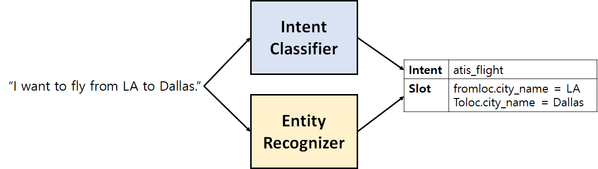

# NLU-Benchmark : Natural Language Understanding Benchmark

**NLU-Benchmark**는 Close Domain 챗봇 또는 Task-Oriented 인공지능 비서 시스템을 위한 자연어 이해 실험 코드를 제공합니다. **NLU-Benchmark**에서 제공하는 실험은 다음과 같습니다.

* 의도 분류(Intent Classification) : 발화문이 어떠한 의도를 담고 있는지 분류
* 엔터티 인식(Entity Recognition) : 발화문에서의 엔터티 정보 추출

---



---

**NLU-Benchmark**는 Hugginface와 PyTorch Lightning을 기반으로 코드가 작성되었으며, 다양한 언어 모델들에 대한 실험을 지원합니다.

## Dependencies
* torch==1.9.0
* pytorch-lightning==1.4.1
* transformers>=4.7.0
* pandas
* sentencepiece
* scikit-learn
* seqeval

## Usage
### 1. 데이터셋 다운로드
**NLU-Benchmark**에서는 다음과 같은 데이터셋들을 지원합니다.

| 데이터셋 이름 | 언어   | train | dev   | test  | 링크   |           
| :---------- | :---: | :---: | :---: | :---: | :---: |
| ATIS        | `en`  | ✔     | ✔    | ✔     | [LINK](https://github.com/yuanxiaosc/BERT-for-Sequence-Labeling-and-Text-Classification/tree/master/data/atis_Intent_Detection_and_Slot_Filling)  |
| SNIPS       | `en`  | ✔     | ✔    | ✔     | [LINK](https://github.com/yuanxiaosc/BERT-for-Sequence-Labeling-and-Text-Classification/tree/master/data/snips_Intent_Detection_and_Slot_Filling)  |

* 데이터셋들을 링크에서 다운로드 받은 후에, `data` 폴더 밑에 각 데이터셋의 이름별 폴더를 생성한 후에 그곳에 다운로드 받은 데이터셋들을 저장합니다. ex) ATIS 데이터셋의 경우, `data/atis` 폴더에 `train`, `valid`, `test`를 저장

* 링크를 통해 다운로드 받은 폴더들에는 다음과 같은 파일들이 저장되어 있습니다.
    * `seq.in` : 발화 문장들이 저장되어 있습니다.
    * `label` : `seq.in`에서의 각 문장들에 대한 의도(intent)가 저장되어 있습니다.
    * `seq.out` : `seq.in`에서의 각 문장들에 대한 Sequence Label들이 저장되어 있습니다. 저장되어 있는 Sequence Label은 [BIO Format](https://en.wikipedia.org/wiki/Inside%E2%80%93outside%E2%80%93beginning_(tagging))을 따릅니다.

### 2. 데이터셋 전처리
**NLU-Benchmark**를 통해 의도 분류 실험과 엔터티 인식 실험을 수행하려면 각 데이터셋의 레이블 사전이 필요합니다. 

다음과 같은 명령어를 수행하면 의도 레이블들에 대한 사전인 `intent.vocab`과 엔터티 레이블들에 대한 사전인 `entity.vocab`이 생성됩니다.

* `--data_name` : 레이블 사전을 생성하고자 하는 데이터셋 이름 ex) `atis`, `snips`

```bash
python data/build_label_vocabs.py --data_name {$DATA_NAME}
```

### 3. Intent Classification : Training and Evaluation
다음과 같은 명령을 실행하여 의도 분류 실험을 수행합니다.

* `--model_type` : 실험을 수행하고자 하는 언어모델의 타입 ex) `bert`, `albert`
* `--model_name` : 실험을 수행하고자 하는 언어모델의 체크포인트 이름 ex) `bert-base-cased`, `albert-base-v2`
* `--data_name` : 실험을 수행하고자 하는 데이터셋 이름 ex) `atis`, `snips`
* `--do_train` : 학습 수행
* `--do_eval` : 평가 수행
* `--num_train_epochs` : 학습시, 에폭 횟수
* `--gpu_id` : 사용하고자 하는 gpu id
* `--batch_size` : 배치 크기

```bash
python run_intent_classification.py --model_type {$MODEL_TYPE} \
                                    --model_name {$MODEL_NAME} \
                                    --data_name {$DATA_NAME} \
                                    --do_train \
                                    --do_eval \
                                    --num_train_epochs 20 \
                                    --gpu_id 0 \
                                    --batch_size 32
```

### 4. Entity Recognition : Training and Evaluation
다음과 같은 명령을 실행하여 엔터티 인식을 수행합니다.

* `--model_type` : 실험을 수행하고자 하는 언어모델의 타입 ex) `bert`, `albert`
* `--model_name` : 실험을 수행하고자 하는 언어모델의 체크포인트 이름 ex) `bert-base-cased`, `albert-base-v2`
* `--data_name` : 실험을 수행하고자 하는 데이터셋 이름 ex) `atis`, `snips`
* `--do_train` : 학습 수행
* `--do_eval` : 평가 수행
* `--num_train_epochs` : 학습시, 에폭 횟수
* `--gpu_id` : 사용하고자 하는 gpu id
* `--batch_size` : 배치 크기

```bash
python run_entity_recognition.py --model_type {$MODEL_TYPE} \
                                 --model_name {$MODEL_NAME} \
                                 --data_name {$DATA_NAME} \
                                 --do_train \
                                 --do_eval \
                                 --num_train_epochs 20 \
                                 --gpu_id 0 \
                                 --batch_size 32
```

## Result
실험에 적용한 하이퍼파라미터는 다음과 같습니다.

| Hyper Parameter    | Value                | 
| :----------------: | :------------------: |
| `max_seq_length`   | 128                  |
| `batch_size`       | 32                   |
| `learning_rate`    | 5e-5                 |
| `num_train_epochs` | 20                   |

* 아래의 실험 결과들을 보시면 전체적으로 `large` 크기의 모델들이 성능이 낮은 것을 확인할 수 있습니다. 이는 epoch과 batch size를 늘림으로써 해결할 수 있을 것으로 생각합니다.

### 1. ATIS 데이터셋 : Intent Classification

| Model Type    | Model Name                                                                                        | Accuracy(%) |
| :------------ | :------------------------------------------------------------------------------------------------ | :---------: |
| bert          | [bert-base-cased](https://huggingface.co/bert-base-cased)                                         | 97.31       |
|               | [bert-base-uncased](https://huggingface.co/bert-base-uncased)                                     | 96.84       |
|               | [bert-large-cased](https://huggingface.co/bert-large-cased)                                       | 97.64       |
|               | [bert-large-uncased](https://huggingface.co/bert-large-uncased)                                   | **97.87**   |
| distilbert    | [distilbert-base-cased](https://huggingface.co/distilbert-base-cased)                             | 96.97       |
|               | [distilbert-base-uncased](https://huggingface.co/distilbert-base-uncased)                         | **97.31**   |
| roberta       | [roberta-base](https://huggingface.co/roberta-base)                                               | 95.74       |
|               | [roberta-large](https://huggingface.co/roberta-large)                                             | **97.64**   |
| albert        | [albert-base-v2](https://huggingface.co/albert-base-v2)                                           | **97.08**   |
|               | [albert-large-v2](https://huggingface.co/albert-large-v2)                                         | 83.76       |
| xlnet         | [xlnet-base-cased](https://huggingface.co/xlnet-base-cased)                                       | **97.76**   |
|               | [xlnet-large-cased](https://huggingface.co/xlnet-large-cased)                                     | 70.77       |
| electra       | [google/electra-small-discriminator](https://huggingface.co/google/electra-small-discriminator)   | 88.91       |
|               | [google/electra-base-discriminator](https://huggingface.co/google/electra-base-discriminator)     | **95.29**   |
|               | [google/electra-large-discriminator](https://huggingface.co/google/electra-large-discriminator)   | 70.77       |

### 2. ATIS 데이터셋 : Entity Recognition

| Model Type    | Model Name                                                                                        | Precision(%) | Recall(%)    | F1 Score(%)  |
| :------------ | :------------------------------------------------------------------------------------------------ | :----------: | :----------: | :----------: |
| bert          | [bert-base-cased](https://huggingface.co/bert-base-cased)                                         | 94.91        | 95.48        | 95.20        |
|               | [bert-base-uncased](https://huggingface.co/bert-base-uncased)                                     | 94.89        | 95.69        | 95.29        |
|               | [bert-large-cased](https://huggingface.co/bert-large-cased)                                       | 95.36        | 95.73        | 95.54        |
|               | [bert-large-uncased](https://huggingface.co/bert-large-uncased)                                   | **95.53**    | **95.80**    | **95.67**    |
| distilbert    | [distilbert-base-cased](https://huggingface.co/distilbert-base-cased)                             | **94.68**    | **95.38**    | **95.03**    |
|               | [distilbert-base-uncased](https://huggingface.co/distilbert-base-uncased)                         | 94.38        | **95.38**    | 94.88        |
| roberta       | [roberta-base](https://huggingface.co/roberta-base)                                               | 94.78        | 95.48        | 95.13        |
|               | [roberta-large](https://huggingface.co/roberta-large)                                             | **94.99**    | **95.62**    | **95.31**    |
| albert        | [albert-base-v2](https://huggingface.co/albert-base-v2)                                           | **94.74**    | **95.27**    | **95.00**    |
|               | [albert-large-v2](https://huggingface.co/albert-large-v2)                                         | 94.24        | 95.24        | 94.74        |
| xlnet         | [xlnet-base-cased](https://huggingface.co/xlnet-base-cased)                                       | **95.02**    | **95.52**    | **95.27**    |
|               | [xlnet-large-cased](https://huggingface.co/xlnet-large-cased)                                     | 94.86        | 95.13        | 95.00        |
| electra       | [google/electra-small-discriminator](https://huggingface.co/google/electra-small-discriminator)   | 83.70        | 83.99        | 83.84        |
|               | [google/electra-base-discriminator](https://huggingface.co/google/electra-base-discriminator)     | **94.72**    | **95.62**    | **95.17**    |
|               | [google/electra-large-discriminator](https://huggingface.co/google/electra-large-discriminator)   | 94.45        | 95.45        | 94.95        |

### 3. SNIPS 데이터셋 : Intent Classification

| Model Type    | Model Name                                                                                        | Accuracy(%) |
| :------------ | :------------------------------------------------------------------------------------------------ | :---------: |
| bert          | [bert-base-cased](https://huggingface.co/bert-base-cased)                                         | 97.14       |
|               | [bert-base-uncased](https://huggingface.co/bert-base-uncased)                                     | 97.71       |
|               | [bert-large-cased](https://huggingface.co/bert-large-cased)                                       | **98.14**   |
|               | [bert-large-uncased](https://huggingface.co/bert-large-uncased)                                   | 98.00       |
| distilbert    | [distilbert-base-cased](https://huggingface.co/distilbert-base-cased)                             | **98.14**   |
|               | [distilbert-base-uncased](https://huggingface.co/distilbert-base-uncased)                         | 97.57       |
| roberta       | [roberta-base](https://huggingface.co/roberta-base)                                               | 97.71       |
|               | [roberta-large](https://huggingface.co/roberta-large)                                             | **98.14**   |
| albert        | [albert-base-v2](https://huggingface.co/albert-base-v2)                                           | **98.00**   |
|               | [albert-large-v2](https://huggingface.co/albert-large-v2)                                         | 96.28       |
| xlnet         | [xlnet-base-cased](https://huggingface.co/xlnet-base-cased)                                       | **97.14**   |
|               | [xlnet-large-cased](https://huggingface.co/xlnet-large-cased)                                     | 17.57       |
| electra       | [google/electra-small-discriminator](https://huggingface.co/google/electra-small-discriminator)   | **97.57**   |
|               | [google/electra-base-discriminator](https://huggingface.co/google/electra-base-discriminator)     | 96.99       |
|               | [google/electra-large-discriminator](https://huggingface.co/google/electra-large-discriminator)   | 11.42       |

### 4. SNIPS 데이터셋 : Entity Recognition

| Model Type    | Model Name                                                                                        | Precision(%) | Recall(%)    | F1 Score(%)  |
| :------------ | :------------------------------------------------------------------------------------------------ | :----------: | :----------: | :----------: |
| bert          | [bert-base-cased](https://huggingface.co/bert-base-cased)                                         | 93.27        | 94.58        | 93.92        |
|               | [bert-base-uncased](https://huggingface.co/bert-base-uncased)                                     | 94.32        | 95.58        | 94.95        |
|               | [bert-large-cased](https://huggingface.co/bert-large-cased)                                       | 93.97        | 95.86        | 94.91        |
|               | [bert-large-uncased](https://huggingface.co/bert-large-uncased)                                   | **95.08**    | **96.14**    | **95.61**    |
| distilbert    | [distilbert-base-cased](https://huggingface.co/distilbert-base-cased)                             | 93.74        | 95.41        | **94.57**    |
|               | [distilbert-base-uncased](https://huggingface.co/distilbert-base-uncased)                         | **93.59**    | **95.47**    | 94.52        |
| roberta       | [roberta-base](https://huggingface.co/roberta-base)                                               | 90.63        | 93.01        | 91.81        |
|               | [roberta-large](https://huggingface.co/roberta-large)                                             | **93.19**    | **94.86**    | **94.01**    |
| albert        | [albert-base-v2](https://huggingface.co/albert-base-v2)                                           | **93.57**    | **95.25**    | **94.40**    |
|               | [albert-large-v2](https://huggingface.co/albert-large-v2)                                         | 91.58        | 93.57        | 92.56        |
| xlnet         | [xlnet-base-cased](https://huggingface.co/xlnet-base-cased)                                       | 93.74        | 95.41        | 94.57        |
|               | [xlnet-large-cased](https://huggingface.co/xlnet-large-cased)                                     | **94.85**    | **95.75**    | **95.30**    |
| electra       | [google/electra-small-discriminator](https://huggingface.co/google/electra-small-discriminator)   | 92.31        | 94.58        | 93.43        |
|               | [google/electra-base-discriminator](https://huggingface.co/google/electra-base-discriminator)     | **93.36**    | **95.19**    | **94.27**    |
|               | [google/electra-large-discriminator](https://huggingface.co/google/electra-large-discriminator)   | 92.83        | 94.86        | 93.83        |

## TODO List
- [ ] README (Version. EN)
- [ ] CRF 추가

## References
- [yuanxiaosc/BERT-for-Sequence-Labeling-and-Text-Classification](https://github.com/yuanxiaosc/BERT-for-Sequence-Labeling-and-Text-Classification)
- [huggingface/transformers](https://github.com/huggingface/transformers)
- [monologg/KoBERT-NER](https://github.com/monologg/KoBERT-NER)

---

추가적으로 문의 사항이 있으시면 해당 repository의 issue를 등록해주시거나 sehunhu5247@gmail.com으로 문의해주시면 감사하겠습니다.